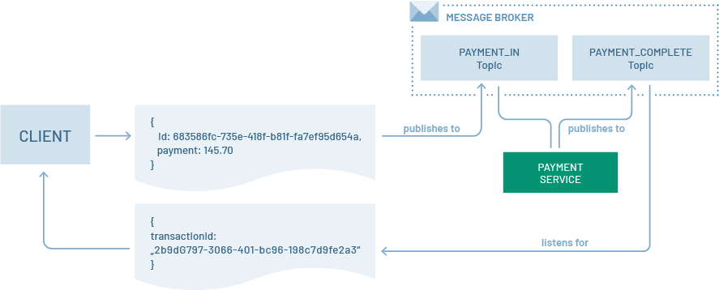
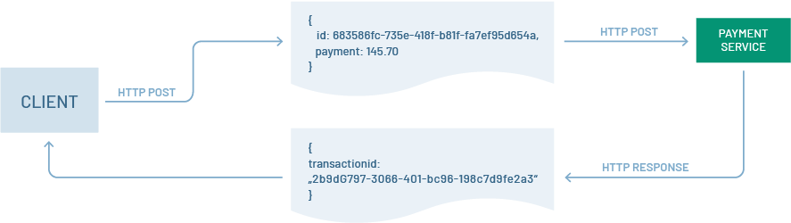

# Testing Event-Driven Application Architectures: An Asynchronous Approach
[Reference](https://www.testrail.com/blog/event-driven-application-architectures/)

## What is an event-driven application architecture
Basically, an event-driven application architecture is one in which services (aka functions) within an application input data and output data via messages that are stored in a message queue. This differs from a synchronous architecture, in which data is passed straight to a service by making a direct call.



The canonical example of a synchronous interaction is the standard request-response communication to and from a web server. A caller makes a request to a web server and then waits to receive a response. The caller is “locked” in the interaction until a response is returned. The response might take a millisecond, or it might take a few seconds, but the caller can do nothing until the interaction completes.



The benefit of an event-driven application architecture is that there is no blocking between processes. The client doesn’t have to wait around for a response. All that’s required is to listen for the response at a predefined source on the message broker.

Event-driven architectures are well suited for applications such as high-speed trading on a stock exchange, or even for ride-share programs. For example, instead of your cell phone having to keep asking the ride-share server where the car is via an ongoing series of HTTP requests and responses, the client application wires into a topic on a message broker and receives messages containing location information as the car moves along.

While event-driven architectures have benefits, they can be a challenge to test. In terms of performance testing, it’s not simply a matter of measuring the time between a request and response. A message can go out and the follow-up message will be available at any time.

Also, network input and output to and from the broker, the efficiency of the broker, the efficiency of the algorithms processing the event data, and even the structure of the event messages can affect the system performance. There are many factors to consider:

## Factors about testing Event-Driven Application Architectures
### Logging
In order to get the data generated when testing an event-driven application, you need comprehensive logging to capture the information and an `aggregation framework` to collect it.

Tools: Examples of such frameworks are Fluentd and Logstash. If you’re using a cloud provider, there are products such as Amazon CloudWatch or Google Cloud Stackdriver. Not only is log aggregation important, but you’ll also need a way to analyze and view the log information once it’s gathered. Then you can use a product such as Kibana, Splunk or Grafana.

This is where distributed tracing comes into play.

### Distributed Tracing
Distributed tracing is designed to monitor the complete activity path of a transaction throughout the entire system. A tracing client is installed on each computing artifact that hosts a service. The client monitors activity and sends back information organized to a particular workflow instance.
- Wavefront
- Jaeger

### The Testing Hierarchy Still Holds
The biggest difference between testing synchronous applications and those that are based in event-driven architectures is having to accommodate the asynchronous nature of the interactions. Developers still have to unit test. Integration testing still needs to be done, as does performance and deployment testing.

Higher-level testing will also require using automation to provision the messaging infrastructure. And aggregated logging and distributed tracing need to be part of the messaging infrastructure; otherwise, test practitioners will have no way to observe and measure the results of their efforts. The logging and tracing facilities also will need to accommodate system monitoring as well as application monitoring. As mentioned earlier, in an event-driven application architecture, millions of messages will be moving around the system at near-instantaneous speeds. One bad network router or slow disk drive can have as much impact on application performance as an inefficient data retrieval algorithm.

## how to test an event driven architect application? What's the key difference between test this and testing a normal synchronized application?
Testing an event-driven architecture (EDA) application involves a different approach compared to testing a normal synchronous application. In an event-driven system, components communicate through events or messages, and the timing and sequencing of these events are crucial. Here are some key considerations and differences when testing an event-driven architecture:

### Key Considerations for Testing Event-Driven Architectures:

1. **Asynchronous Nature:**
   - **Challenge:** In EDA, events are often processed asynchronously, which means testing must account for the fact that events may not be processed immediately.
   - **Solution:** Implement mechanisms to ensure that events are eventually processed and that the system behaves correctly under different timing scenarios.

2. **Event Ordering:**
   - **Challenge:** The order in which events are received and processed is crucial in many event-driven systems.
   - **Solution:** Test scenarios where events arrive out of order, and ensure that the system can handle and process them correctly.

3. **Event Delivery Guarantees:**
   - **Challenge:** Event-driven systems may offer different delivery guarantees (e.g., at least once, exactly once, etc.).
   - **Solution:** Design tests to validate the delivery semantics and ensure that duplicate events or missed events are handled appropriately.

4. **Fault Tolerance:**
   - **Challenge:** In a distributed event-driven system, components may fail or become temporarily unreachable.
   - **Solution:** Test how the system behaves under various failure scenarios. This includes testing the recovery mechanisms and ensuring that events are not lost during failures.

5. **Event Schema Evolution:**
   - **Challenge:** Event schemas may evolve over time, and systems must handle backward and forward compatibility.
   - **Solution:** Test the system's ability to handle different versions of events, especially when components are updated independently.

6. **Integration Testing:**
   - **Challenge:** Components in an event-driven system may be loosely coupled, and it's crucial to test how they integrate.
   - **Solution:** Conduct integration tests that simulate the flow of events through the entire system. This may involve using tools to simulate events and monitoring the behavior of the system.

7. **Idempotency:**
   - **Challenge:** Events may be processed more than once due to retries or failures.
   - **Solution:** Ensure that the system is designed to be idempotent, meaning that processing an event multiple times has the same result as processing it once. This is especially important in systems with at-least-once delivery semantics.

### Key Differences from Testing Synchronous Applications:

1. **Timing and Asynchrony:**
   - In synchronous applications, the flow of execution is predictable and immediate. In an event-driven system, you must consider asynchronous processing and potential delays.

2. **Ordering and Sequencing:**
   - In event-driven systems, the order of events is often significant. Testing must cover scenarios where events arrive out of order or with delays.

3. **Stateful Testing:**
   - Event-driven systems often have stateful components. Testing should cover scenarios where components maintain state across multiple events.

4. **Distribution and Network Considerations:**
   - Distributed nature of event-driven systems introduces additional challenges related to network latency, reliability, and potential network failures.

5. **Scalability:**
   - Scalability testing is critical in event-driven architectures, as the system should be able to handle a large number of events concurrently.

6. **Integration and End-to-End Testing:**
   - Given the loosely coupled nature of event-driven systems, integration testing and end-to-end testing become more complex and crucial.

7. **Error Handling:**
   - Testing error-handling scenarios, including retries and recovery from failures, is essential in event-driven systems.

In conclusion, testing an event-driven architecture requires a comprehensive strategy that considers the unique characteristics of `asynchronous`, `distributed`, and `loosely-coupled` systems. Emphasis should be placed on scenarios related to event processing, ordering, fault tolerance, and integration testing. Automated testing and tools for simulating events can be valuable in validating the correctness and reliability of the system.

### Other tests to account for
1.	Unit Tests:
Test individual components, such as event producers, consumers, and processing functions, in isolation.
Verify that each component handles events and data correctly.
2.	Functional / end-to-end Tests:
Test the end-to-end functionality of the event-driven system.
Verify that events trigger the expected actions or workflows and produce the desired outcomes.
3.	Performance Tests:
Assess the system's performance under different event load scenarios.
Measure event throughput, latency, and resource utilisation to identify bottlenecks or performance issues.
4.	Scalability Tests:
Determine how well the system scales when the event load increases.
Test auto-scaling mechanisms and ensure they can handle higher event volumes.
5.	Reliability Tests:
Assess the system's reliability by injecting failures or simulating issues (e.g., network failures, message loss) and ensuring it recovers gracefully.
6.	Security Tests:
Verify that the event-driven system is protected against common security threats, such as data breaches, unauthorized access, and injection attacks.
7.	Concurrency and Parallelism Tests:
Test the system's ability to handle multiple events and concurrent processing.
Ensure that event-driven components can work in parallel without conflicts or data corruption.
8.	State Management Tests:
Test how the system handles stateful events and maintains consistent state across components.
Verify that stateful processing is reliable and scalable.
9.	Error Handling and Recovery Tests:
Validate how the system handles errors, exceptions, and unexpected situations.
Test error reporting, logging, and recovery mechanisms.
10. Regression Tests:
Continuously run tests to ensure that new code changes or updates don't introduce regressions or break existing functionality.

# Message brokers
- Kafka</br>
Kafka is designed as a distributed streaming platform. It is particularly suitable for real-time data streaming and event sourcing. Kafka provides strong durability and fault-tolerance.
- ActiveMQ</br>
ActiveMQ is a message-oriented middleware that supports the Java Message Service (JMS) API. It follows the traditional message queue model and is suitable for point-to-point and publish-subscribe messaging. Suited for traditional enterprise messaging scenarios where JMS is a requirement.
- RabbitMQ</br>
RabbitMQ is a message broker that supports multiple messaging patterns, including point-to-point and publish-subscribe. It is known for its flexibility and ease of use. Widely used for general-purpose messaging, including task distribution, job queues, and communication between distributed systems. RabbitMQ is known for its simplicity and ease of integration.

# What is Kafka
Apache Kafka is an open-source distributed event streaming platform designed for building real-time data pipelines and streaming applications. It is widely used for handling large volumes of data and enabling real-time analytics. Kafka provides a publish-subscribe model, allowing producers to publish messages, and consumers to subscribe to those messages and process them in real-time.

While the internals of Kafka are implemented in Scala, developers can interact with Kafka using both Scala and Java (exposed some Java APIs), and there are client libraries for other languages as well.

Here's a brief overview of Kafka's key components and how to use it:

## Key Components of Kafka:

1. **Producer:** Producers are responsible for publishing messages to Kafka topics. They generate events or records and send them to Kafka brokers.

2. **Consumer:** Consumers subscribe to Kafka topics and process the messages produced by producers. Consumers can be part of a consumer group for parallel processing.

3. **Topic:** A topic is a logical channel or feed name to which producers publish messages, and consumers subscribe to receive messages. Topics allow for the categorization of messages.

4. **Broker:** Kafka brokers are servers that store the published records in a distributed and fault-tolerant manner. They handle the communication between producers and consumers.

5. **ZooKeeper:** Kafka relies on Apache ZooKeeper for distributed coordination, managing broker metadata, and leader election.

## How to Use Kafka:

Here are the basic steps to get started with using Kafka:

#### 1. **Download and Install Kafka:**

- Download Kafka from the Apache Kafka website: [https://kafka.apache.org/downloads](https://kafka.apache.org/downloads)
- Follow the installation instructions for your operating system.

#### 2. **Start ZooKeeper:**

- Kafka uses ZooKeeper for distributed coordination. Start ZooKeeper first by navigating to the Kafka installation directory and running:

  ```bash
  bin/zookeeper-server-start.sh config/zookeeper.properties
  ```

#### 3. **Start Kafka Brokers:**

- Open a new terminal and start one or more Kafka brokers:

  ```bash
  bin/kafka-server-start.sh config/server.properties
  ```

  You can start multiple brokers for a distributed setup.

#### 4. **Create a Topic:**

Create a Kafka topic to which producers will send messages and consumers will subscribe:

```bash
bin/kafka-topics.sh --create --topic my-topic --bootstrap-server localhost:9092 --partitions 1 --replication-factor 1
```

and we can use this command to display all topics
```bash
kafka-topics.sh --list --bootstrap-server localhost:9092
```

#### 5. **Produce Messages:**

- Produce messages to the created topic using the Kafka producer:

  ```bash
  bin/kafka-console-producer.sh --topic my-topic --bootstrap-server localhost:9092
  ```

  Type messages, and they will be sent to the topic.

#### 6. **Consume Messages:**

- Open a new terminal and start a Kafka consumer to receive and process messages:

  ```bash
  bin/kafka-console-consumer.sh --topic my-topic --bootstrap-server localhost:9092 --from-beginning
  ```

  The consumer will display messages as they are produced to the topic.

#### 7. **Explore Further:**

- Explore Kafka's features such as partitions, consumer groups, and configurations.
- Integrate Kafka with programming languages using Kafka client libraries.
- Implement more advanced scenarios like fault tolerance, scalability, and topic partitioning.

This is a very basic introduction to using Kafka. In real-world scenarios, Kafka is often used in conjunction with other tools and frameworks to build robust, scalable, and fault-tolerant event-driven architectures.

## What does partitioning do in kafka
In Apache Kafka, partitioning is a crucial concept that plays a fundamental role in the distribution, scalability, and parallel processing of data across a Kafka cluster. Partitioning is the process of dividing a Kafka topic into multiple, smaller, and independent sub-streams called partitions. Each partition acts as a standalone ordered log of records.

Key points about partitioning in Kafka:

1. **Parallelism and Scalability:**
   - Partitions allow Kafka to achieve parallelism and horizontal scalability. Multiple consumers can process different partitions concurrently, providing parallel processing capabilities.
   - Kafka brokers can distribute partitions across different nodes, enabling the system to scale horizontally as more nodes are added to the cluster.

2. **Ordering Guarantee:**
   - Records within a partition are strictly ordered based on their offset. The offset is a unique identifier assigned to each record within a partition.
   - While ordering is guaranteed within a partition, it is not guaranteed across partitions. Different partitions may have records with different offsets and, therefore, different orderings.

3. **Producer Decision:**
   - Producers in Kafka decide to which partition a record should be sent. This decision can be made explicitly by the producer or determined by a partitioning strategy.
   - The default partitioning strategy is round-robin, where messages are distributed evenly across all available partitions.

4. **Consumer Group Parallelism:**
   - In Kafka, consumers are organized into consumer groups. Each partition can be consumed by only one consumer within a consumer group at a time.
   - If you have more consumers than partitions, some consumers will be idle. If you have more partitions than consumers, consumers within a group can work in parallel.

5. **Replication and Fault Tolerance:**
   - Partitions are replicated for fault tolerance. Each partition has a configurable number of replicas (typically more than one). Replicas are copies of the partition stored on different broker nodes.
   - Replication ensures that if a broker or partition becomes unavailable, another replica can take over, preserving data availability.

6. **Scaling Consumers and Producers:**
   - As the load on a Kafka topic increases, you can add more partitions to scale the throughput and parallelism.
   - Scaling consumers is achieved by adding more consumer instances within the same consumer group.

Example:

```plaintext
Topic: logs
  Partition 0: [record0, record3, record6, ...]
  Partition 1: [record1, record4, record7, ...]
  Partition 2: [record2, record5, record8, ...]
```

In the above example, the "logs" topic has three partitions, and each partition contains an ordered log of records. This allows for parallel processing and scalability in consuming and producing records within the Kafka cluster.

## What is Scala
Scala is a general-purpose programming language that blends object-oriented and functional programming paradigms. It was created by Martin Odersky and first released in 2003. The name "Scala" is a blend of "scalable" and "language," highlighting its goal of being scalable from small scripts to large systems.

Key features of Scala include:

1. **Object-Oriented and Functional:** Scala is a hybrid language that supports both object-oriented and functional programming styles. It allows developers to use mutable and immutable data structures, pattern matching, and higher-order functions.

2. **Static Typing:** Scala is statically typed, which means that the types of variables are checked at compile-time rather than runtime. This can help catch errors early in the development process.

3. **Concurrency:** Scala has built-in support for concurrent and parallel programming through libraries like Akka. It includes features like actors for building concurrent and distributed systems.

4. **Interoperability:** Scala is designed to be compatible with Java, allowing developers to use Java libraries and frameworks seamlessly. Scala code can be integrated with existing Java codebases, and both languages can coexist in the same project.

5. **Expressiveness:** Scala is known for its concise and expressive syntax, which can lead to more readable and maintainable code. It supports features such as type inference, pattern matching, and implicit conversions.

6. **Scalability:** Scala is designed to be scalable, both in terms of the size of the codebase it can handle and the range of application domains it can address.

7. **Tool Support:** Scala has a range of tools and libraries that support development, including build tools like sbt and testing frameworks like ScalaTest.

8. **Community and Ecosystem:** Scala has an active and growing community of developers, and there is a rich ecosystem of libraries and frameworks built on top of the language.

One of the notable use cases for Scala is Apache Spark, a distributed data processing engine, where Scala is the primary language for writing Spark applications. It's also used in various other domains, including web development, microservices, and data science.

Overall, Scala is a versatile language that appeals to developers who want the expressiveness of a functional language while still having access to object-oriented programming features.

# About TopologyTestDriver
[reference](https://www.confluent.io/blog/testing-kafka-streams/) about Testing Kafka Streams using TopologyTestDriver
## What is TopologyTestDriver
`TopologyTestDriver` is a testing utility provided by the Apache Kafka Streams library for testing Kafka Streams applications. It allows you to create an isolated environment for testing your Kafka Streams topology without the need for an actual Kafka cluster. This is particularly useful for unit testing and integration testing of your stream processing logic.

Key features and use cases of `TopologyTestDriver`:

1. **Isolated Testing Environment:**
   - `TopologyTestDriver` provides an isolated environment for testing your Kafka Streams topology. It allows you to test your stream processing logic without interacting with a real Kafka cluster.

2. **In-memory State Stores:**
   - When testing with `TopologyTestDriver`, the state stores used by your Kafka Streams application are in-memory. This means that you can perform stateful operations and verify the state changes within your tests.

3. **Controlled Advancement of Time:**
   - The test driver allows you to control the advancement of time within your application. This is useful for testing time-dependent operations, such as windowed aggregations.

4. **Easy Verification of Output:**
   - You can easily verify the output produced by your Kafka Streams topology. This includes inspecting emitted records, checking state store contents, and validating any produced records.

5. **Synchronous Testing:**
   - Testing with `TopologyTestDriver` is synchronous. This makes it straightforward to write tests and assertions without the need for complex asynchronous testing mechanisms.

6. **Easy Setup and Teardown:**
   - Setting up and tearing down the testing environment with `TopologyTestDriver` is simple, making it convenient for writing clean and modular tests.

Here's a basic example of using `TopologyTestDriver`:

```java
import org.apache.kafka.streams.Topology;
import org.apache.kafka.streams.TopologyTestDriver;
import org.apache.kafka.streams.test.ConsumerRecordFactory;
import org.apache.kafka.streams.test.OutputVerifier;
import org.junit.jupiter.api.AfterEach;
import org.junit.jupiter.api.BeforeEach;
import org.junit.jupiter.api.Test;

import java.util.Properties;

class MyTopologyTest {

    private TopologyTestDriver testDriver;
    private ConsumerRecordFactory<String, String> recordFactory = new ConsumerRecordFactory<>("input-topic", "key", "value");

    @BeforeEach
    void setUp() {
        Properties props = new Properties();
        // Set up your Kafka Streams configuration properties
        // props.put(...);

        // Set up your Kafka Streams topology
        Topology topology = MyTopology.buildTopology();

        // Initialize TopologyTestDriver with topology and configuration
        testDriver = new TopologyTestDriver(topology, props);
    }

    @AfterEach
    void tearDown() {
        // Close TopologyTestDriver after testing
        testDriver.close();
    }

    @Test
    void testMyTopology() {
        // Pipe input data into the topology
        testDriver.pipeInput(recordFactory.create("input-topic", "key", "value"));

        // Perform assertions on the output
        OutputVerifier.compareValue(testDriver.readOutput("output-topic", stringDeserializer), "expected-output-value");
    }
}
```

In this example, `MyTopology` is a class that builds a Kafka Streams topology, and `testMyTopology` is a test method that uses `TopologyTestDriver` to test the topology. The test driver is initialized with the topology and configuration, and then input data is piped into the topology. Finally, assertions are made on the output.

This is a basic example, and the actual testing logic will depend on your specific Kafka Streams application and its processing logic. The `TopologyTestDriver` provides various methods for inspecting and verifying the output of your topology.

## A few more things to note about TopologyTestDriver
- It is used to test Kafka Streams applications. Kafka Streams is a Java library that is part of the Apache Kafka project. It is designed to enable developers to build real-time stream processing applications on top of Kafka.
- TopologyTestDriver is primarily designed for `unit testing` Kafka Streams applications
- TopologyTestDriver is synchronous in nature. Thus it doesn’t fully reflect the asynchronous aspects of real Kafka cluster behavior
- The crucial difference between TopologyTestDriver- and TestContainers-based tests is that the former are unit tests, while the latter are integration tests.
- The problem with EmbeddedKafka or TestContainers tests is that they are asynchronous, and this implies certain difficulties and limitations. To make test code clearer and reduce test running time, you can use the Awaitility library. If you are using Spring, you might also want to take a look at [spring-test-kafka](https://github.com/jupiter-tools/spring-test-kafka), which further simplifies dataset-driven testing of Kafka applications and has Awaitility under the hood

## What does Awaitility do in testing event-driven architecture
`Awaitility` is a library in the Java ecosystem designed to simplify asynchronous testing, especially in scenarios where you are dealing with event-driven architectures or asynchronous operations. It provides a set of fluent and expressive methods for waiting until certain conditions are met during the test execution.

Here are some key features and use cases for `Awaitility` in the context of testing an event-driven architecture:

1. **Waiting for Conditions:**
   - With `Awaitility`, you can wait for certain conditions to be true before proceeding with the test. This is particularly useful in scenarios where events are expected to occur asynchronously.

2. **Event-Driven Testing:**
   - In event-driven architectures, you often deal with the publishing and consumption of events. `Awaitility` can be used to wait for the occurrence of specific events and validate their properties or state.

3. **Fluent API:**
   - The library provides a fluent and expressive API that allows you to define conditions and assertions concisely. This makes the test code more readable and maintainable.

4. **Support for Java 8 Lambda Expressions:**
   - `Awaitility` supports Java 8 lambda expressions, allowing you to express conditions in a more concise and modern way.

5. **Timeouts and Polling Intervals:**
   - You can specify the maximum time to wait for a condition (`atMost`) and the interval at which `Awaitility` checks the condition (`pollInterval`). This provides flexibility in adjusting the timing constraints based on the specific behavior of your application.

Here's a simple example to illustrate its usage:

```java
import static org.awaitility.Awaitility.*;

// ...

// Wait for a condition (e.g., an event) to be true within a specified time
await().atMost(5, SECONDS).until(() -> someConditionIsMet());

// Wait for a specific event to occur
await().atMost(10, SECONDS).until(() -> eventOccurred());

// Use Java 8 lambda expressions for concise conditions
await().atMost(5, SECONDS).until(() -> calculateResult() > 42);
```

In the context of event-driven architectures, `Awaitility` can be particularly helpful when you need to wait for events to be processed, messages to be delivered, or any other asynchronous activity to complete before making assertions in your tests.

Keep in mind that while `Awaitility` is a powerful tool for handling asynchronous testing scenarios, it's important to use it judiciously and consider the specific needs and characteristics of your application.

# Vulnerability testing
## What is Vulnerability testing
Vulnerability testing is a type of security testing that focuses on identifying vulnerabilities or weaknesses in a system that could be exploited by attackers. The goal is to assess the security posture of a system, application, or network and discover potential weaknesses that could lead to security breaches.

Key aspects of vulnerability testing include:

1. **Identification of Weaknesses:** Vulnerability testing involves actively scanning and probing a system to identify weaknesses in its security controls. This can include vulnerabilities in software, misconfigurations, or other issues that could be exploited.

2. **Common Vulnerabilities and Exposures (CVEs):** Testers often check for known vulnerabilities listed in public databases such as the Common Vulnerabilities and Exposures (CVE) system. These databases maintain a catalog of publicly known security vulnerabilities.

3. **Security Assessments:** Vulnerability testing is part of a broader security assessment strategy. It helps organizations understand their security posture and assess the effectiveness of existing security measures.

4. **Automated Scanning Tools:** Vulnerability testing is often conducted using automated scanning tools that can identify common vulnerabilities quickly and efficiently. These tools scan networks, applications, or systems for known security issues.

5. **Manual Testing:** In addition to automated tools, manual testing is crucial to identify vulnerabilities that automated tools might miss. Manual testing involves in-depth analysis by security experts who simulate real-world attack scenarios.

6. **Penetration Testing:** Vulnerability testing is closely related to penetration testing (pen testing). While vulnerability testing focuses on identifying weaknesses, penetration testing takes it a step further by attempting to exploit these vulnerabilities to demonstrate the potential impact on the system.

7. **Reporting and Remediation:** After identifying vulnerabilities, a detailed report is generated, highlighting the vulnerabilities discovered, their potential impact, and recommended remediation measures. This information helps organizations prioritize and address security issues.

8. **Regular Testing:** Security is an ongoing concern, and vulnerabilities can emerge as new threats arise or as systems change. Regular vulnerability testing is essential to maintaining a strong security posture over time.

Vulnerability testing is a critical component of a comprehensive cybersecurity strategy. It helps organizations proactively identify and address security weaknesses, reducing the risk of security incidents and data breaches. Regular testing, along with a robust patch management process, can significantly enhance the security of systems and applications.


# Mozilla Observatory
The Mozilla Observatory is a web security tool developed by Mozilla, the organization behind the Firefox web browser. It provides a set of tests to evaluate the security of a website or web application. The tool checks for various security best practices and potential vulnerabilities, giving website owners and developers insights into how well their sites are protected.

Website owners and developers can use the Mozilla Observatory by entering their website's URL into the tool's web interface. The Observatory then generates a report with a score and detailed information about the security measures implemented on the site.

Key features of the Mozilla Observatory include:

1. **HTTP Security Headers:** It checks whether a website is using recommended security headers like Strict-Transport-Security (HSTS), Content-Security-Policy (CSP), and others.

2. **TLS Configuration:** It assesses the quality of a website's SSL/TLS configuration, ensuring that secure and up-to-date cryptographic protocols and ciphers are in use.

3. **Third-party Resources:** It examines the third-party resources (scripts, stylesheets, etc.) loaded by a website and provides information about their security implications.

4. **Cookies:** It evaluates the use of cookies on a website and checks if they are marked with the "Secure" attribute, indicating that they should only be sent over HTTPS connections.

5. **Cross-Origin Resource Sharing (CORS):** It checks how a website handles cross-origin resource sharing, ensuring that it is configured securely.

6. **Subresource Integrity (SRI):** It verifies whether a website is using SRI to ensure the integrity of externally hosted resources, such as JavaScript libraries.

7. **Email Spoofing Prevention:** It checks for the presence of SPF (Sender Policy Framework) and DMARC (Domain-based Message Authentication, Reporting, and Conformance) records to help prevent email spoofing.

8. **Security Headers:** It assesses the presence and configuration of various security-related HTTP headers.

[official site](https://observatory.mozilla.org/)

And there are lots of similar scanning tool like:
- [SSL Test](https://www.ssllabs.com/ssltest/)
- htbridge.com – TSL/ SSL scanner by High-Tech Bridge
- tls.imirhil.fr – TSL/ SSL scanner by @aeris22
- securityheader.com – HTTP Header analyzer by Scott Helme
- hstspreload.org – HSTS Preload list by Nick Harper 

# What is SSL/TLS?
SSL (Secure Sockets Layer) and TLS (Transport Layer Security) are `cryptographic protocols` designed to secure communication over a computer network, most commonly the internet. They provide a secure channel between two machines or devices, ensuring that the data transmitted between them remains confidential and tamper-proof. Both SSL and TLS protocols are used to establish secure connections, but TLS is the newer and more secure successor to SSL.

# What are Strict-Transport-Security (HSTS), Content-Security-Policy (CSP)?
Strict-Transport-Security (HSTS) and Content-Security-Policy (CSP) are HTTP security headers that web developers can use to enhance the security of their websites. These headers provide instructions to web browsers on how to handle certain aspects of the web page, helping to mitigate various security risks.

# Amazon EventBridge
## What is Amazon EventBridge?
Amazon EventBridge is a serverless, fully managed, and scalable event bus that enables integrations between AWS services, Software as a services (SaaS), and your applications. It simplifies the development of event-driven applications by connecting different services using events. Events are notifications that one service can send to notify changes or occurrences, and other services can respond to those events.

# Play around with Kafka on Windows
Windows Issues
Kafka is not intended to be run on Windows natively and has several issues that may arise over time.

## Install Kafka with Zookeeper on Windows:
Click [here](https://www.conduktor.io/kafka/how-to-install-apache-kafka-on-windows/) for more info
- install WSL2 on Windows 10 using this PowerShell or Windows Command Prompt in `administrator mode`:
   ```
   wsl --install
   ```
- Install a Linux distributions after the initial install, you may also use the command
   ```
   wsl --install -d <Distribution Name>
   ```
- Create a User Name and Password for your Linux distribution

mine username is "charles" and the pw is the common one.</br>
You can find more info from [here](https://learn.microsoft.com/en-us/windows/wsl/setup/environment#set-up-your-linux-username-and-password)
- Install OpenJDK 17 Ubuntu
click [here](https://www.linuxcapable.com/how-to-install-openjdk-17-on-ubuntu-linux/) for more info
- Install Apache Kafka
Follow the steps [here](https://www.conduktor.io/kafka/how-to-install-apache-kafka-on-windows/) again to install Kafka
- Set up Windows Terminal
It is recommended to use WSL with Windows Terminal, especially if you plan to work with multiple command lines. Check the tutorial [here](https://learn.microsoft.com/en-us/windows/wsl/setup/environment#set-up-windows-terminal) and [here](https://learn.microsoft.com/en-us/windows/terminal/install)
- Setup the $PATH environment variable
In order to easily access the Kafka binaries, you can edit your PATH variable by adding the following line to your system run commands to~/.bashrc :
```
PATH="$PATH:~/kafka_2.13-3.0.0/bin"
```
This ensures that you can now run the kafka commands without prefixing them.
- Start Zookeeper

Apache Kafka depends on Zookeeper for cluster management. Hence, prior to starting Kafka, Zookeeper has to be started. There is no need to explicitly install Zookeeper, as it comes included with Apache Kafka.</br>
Make sure your JAVA_HOME environment variable is set first, as instructed in the Install Java section, so that Java 11 is used when doing java -version</br>
From the root of Apache Kafka, run the following command to start Zookeeper:
```
~/kafka_2.13-3.0.0/bin/zookeeper-server-start.sh ~/kafka_2.13-3.0.0/config/zookeeper.properties
```
or you can direct run this command after you setup the $PATH environment variable in the previous step:
```
zookeeper-server-start.sh ~/kafka_2.13-3.0.0/config/zookeeper.properties
```
and you can use Daemon Mode:</br>
You can use the `-daemon` flag to run Zookeeper in daemon mode in the background
- Start Apache Kafka

Open another Shell window and run the following command from the root of Apache Kafka to start Apache Kafka.
```
~/kafka_2.13-3.0.0/bin/kafka-server-start.sh ~/kafka_2.13-3.0.0/config/server.properties
```
or you can direct run this command after you setup the $PATH environment variable in the previous step:
```
kafka-server-start.sh ~/kafka_2.13-3.0.0/config/server.properties
```
Ensure to keep both shell windows opened, otherwise you will shut down Kafka or Zookeeper.

Then continue with the remaining steps from the previous tutorial "How to Use Kafka"

## What is Zookeeper in Kafka
Apache ZooKeeper is a distributed coordination service often used in conjunction with Apache Kafka to manage and coordinate distributed systems. In the context of Kafka, ZooKeeper plays a crucial role in maintaining metadata, managing distributed brokers, and ensuring the reliability and consistency of the Kafka cluster.

Here are some key aspects of ZooKeeper in the context of Kafka:

1. **Distributed Coordination:**
   - ZooKeeper provides a distributed coordination service that allows multiple nodes in a distributed system to synchronize and agree on a common state. This is essential for managing a distributed system like Kafka.

2. **Metadata Management:**
   - Kafka uses ZooKeeper to manage and store metadata related to topics, partitions, brokers, and consumer groups. This metadata is critical for the proper functioning of Kafka clusters.

3. **Leader Election:**
   - ZooKeeper helps in electing a leader among the Kafka brokers for each partition. This leader is responsible for handling reads and writes for a specific partition, ensuring that the data is consistently replicated across the Kafka brokers.

4. **Cluster Membership:**
   - ZooKeeper maintains information about the membership of the Kafka broker nodes in the cluster. It helps in detecting changes in the cluster, such as broker failures or additions.

5. **Configuration Management:**
   - Kafka brokers use ZooKeeper to store and manage configuration information. This includes settings such as broker addresses, topic configurations, and other runtime parameters.

6. **Notification and Events:**
   - ZooKeeper allows Kafka components to subscribe to events, enabling them to be notified of changes in the cluster's state. For example, a Kafka broker can be notified when a new broker joins the cluster or when a partition leader changes.

7. **Sequential Node IDs:**
   - ZooKeeper provides support for creating sequential and ephemeral znodes. Kafka uses these features to implement features such as leader election and ensuring unique identifiers for distributed components.

The use of ZooKeeper in Kafka is often referred to as the "ZooKeeper ensemble." It's important to note that while Kafka historically relied heavily on ZooKeeper for coordination, there have been efforts to reduce this dependency in more recent versions of Kafka. In particular, Kafka has been working on a KIP (Kafka Improvement Proposal) to move away from ZooKeeper for certain metadata operations.

It's recommended to check the documentation and release notes of the specific versions of Kafka you are using for the latest information on the role of ZooKeeper and any changes in the architecture.

## what is embeddedkafka, and what's its advantages and disadvantages against testcontainers
`EmbeddedKafka` and `TestContainers` are both tools used in the context of testing applications, particularly for scenarios involving Apache Kafka and other external dependencies. Let's look at each of them:

### EmbeddedKafka:
1. **Description:**
   - `EmbeddedKafka` is part of the Spring Kafka project and provides an embedded Kafka broker that can be used for testing purposes.
   - It allows you to run an in-memory Kafka broker within your test environment.

2. **Advantages:**
   - **Lightweight Integration:** Since it's part of the Spring ecosystem, it integrates seamlessly with Spring-based applications and test infrastructure.
   - **Fast:** Starts quickly, making it suitable for unit tests and scenarios where you want fast feedback during development.
   - **No External Dependencies:** It doesn't rely on external Docker containers or external Kafka installations.

3. **Disadvantages:**
   - **Limited Realism:** While it's great for fast unit tests, it might not capture all aspects of a real Kafka setup, especially in cases where the behavior of Kafka itself is a critical aspect of the application.

### TestContainers:
Testcontainers is an open source framework for providing throwaway, lightweight instances of databases, message brokers, web browsers, or just about anything that can run in a Docker container.

[Official site](https://testcontainers.com/)

1. **Description:**
   - `TestContainers` is a more general-purpose library that allows you to create and manage containers (Docker containers, in particular) during tests.
   - It can be used for Kafka, databases, messaging systems, and other dependencies.

2. **Advantages:**
   - **Versatility:** It's not limited to Kafka; you can use it for a wide range of other containers and services. This makes it suitable for integration tests that involve multiple components.
   - **Realistic Testing:** Since it uses real containers, it can more accurately mimic a production-like environment, capturing aspects like network latency and container orchestration.

3. **Disadvantages:**
   - **Slower Startup:** Starting Docker containers can take more time compared to an in-memory solution like `EmbeddedKafka`.
   - **External Dependencies:** Requires Docker to be installed on the test machine, which might not be suitable for all development environments.

### Choosing Between Them:

- **Use Case:** If you are primarily testing Kafka-related logic in a Spring application and want fast feedback during development, `EmbeddedKafka` might be a good fit. If your tests involve multiple services, databases, or complex interactions, `TestContainers` could be more suitable.

- **Speed vs Realism:** If you prioritize fast feedback during development, go for `EmbeddedKafka`. If you need a more realistic environment that mimics production conditions closely, consider `TestContainers`.

- **Integration:** If you are working within the Spring ecosystem, using `EmbeddedKafka` might feel more natural. If your project is not Spring-based or has a more diverse set of technologies, `TestContainers` provides a more versatile solution.

In many cases, the choice between them depends on the specific testing needs and the overall architecture of your application.

# Misc & TODOs
## Notes when running the program "spring-kafka" (TODO: not working ATM)
As Kafka topics are not created automatically by default, this application requires that you create the following topics manually.
```
$ bin/kafka-topics.sh --create --bootstrap-server localhost:2181 --replication-factor 1 --partitions 1 --topic baeldung
```
```
$ bin/kafka-topics.sh --create --bootstrap-server localhost:2181 --replication-factor 1 --partitions 5 --topic partitioned
```
```
$ bin/kafka-topics.sh --create --bootstrap-server localhost:2181 --replication-factor 1 --partitions 1 --topic filtered
```
```
$ bin/kafka-topics.sh --create --bootstrap-server localhost:2181 --replication-factor 1 --partitions 1 --topic greeting
```